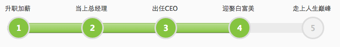

workflowProgress.js
===================
  
Useage
==
``` 
$(function(){
      workflowprogress=$('.workflowprogress').workflowProgress(options,nextstep);
  });
```
Params
===
 - **options**  
     - nodes `Array`  
     - inprocess `String`  `[optional]`
     - nodeWidth `Number` *default:40*
     - nodeTextOffset `Number` *default:40*
     - processTextOffset `Number` *default:40*
 - **nextstep** `Number` *default:null*


Examples
==
``` 
$(function(){
    var nodes=['升职加薪','当上总经理','出任CEO','迎娶白富美','走上人生巅峰'];

    cc=$('.workflowprogress').workflowProgress({nodes:nodes,inprocess:'想想'},5);
    });
```
